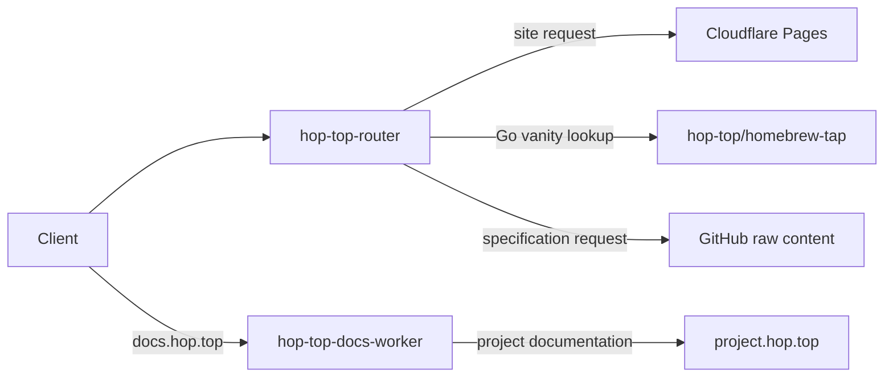

# hop.top architecture

hop.top is the public gateway for the hop-top project family. It combines a
static ecosystem site with edge routing for Go vanity imports, canonical
specification URLs, and project documentation.

## System overview



The repository contains four independently configured Node projects:

| Component | Location | Responsibility |
|---|---|---|
| Edge router | `worker/` | Routes `hop.top` and `spec.hop.top` requests |
| Marketing site | `site/` | Builds the ecosystem homepage and project pages |
| Documentation hub | `docs-worker/` | Proxies project documentation under `docs.hop.top` |
| CLI shell | `src/` | Provides the currently minimal `hop.top` command |

The hosted services are the primary product. The root CLI currently exposes
only Commander-generated help, version, format, and verbose options.

## Edge router

`worker/src/index.ts` is a Hono application deployed as the
`hop-top-router` Cloudflare Worker. It owns routes for `hop.top/*` and
`spec.hop.top/*`.

Routes are evaluated in this order:

1. Known static asset paths are proxied to the subdomain found in the request
   referrer. When no valid hop.top subdomain is present, they fall back to the
   Pages site.
2. Requests shaped as `spec.hop.top/<name>/<version>/<file>` are served from
   `hop-top/spec-<name>/specs/<version>/<file>` on GitHub.
3. A single-segment `hop.top/<package>?go-get=1` request returns Go vanity
   metadata. Reserved `x<number>` names, except `x402`, and `spec` names return
   404.
4. All other requests, including `hop.top/<package>` landing pages, are
   proxied to the Pages site.

### Go vanity resolution

For a vanity request, the router looks for
`hop-top/homebrew-tap/<package>.rb` and reads its `homepage`. This supports
repositories whose GitHub name differs from their vanity name. A missing,
unreadable, or unparseable formula falls back to
`https://github.com/hop-top/<package>`.

The response contains `go-import` and `go-source` metadata plus a timed link
to the repository. Dynamic values are HTML-escaped before insertion. Formula
lookups are cached at the Cloudflare edge for one hour.

### Specification routing

Specification requests are intentionally separate from the Go package
namespace:

```text
https://spec.hop.top/<name>/<version>/<file>
    -> https://raw.githubusercontent.com/hop-top/spec-<name>/main/specs/<version>/<file>
```

The router rejects unsafe path segments and traversal attempts. Successful
responses retain the upstream content type and are cached for five minutes.
Missing upstream content becomes a local 404.

### Site and asset proxying

The catch-all proxy preserves the original path, query, method, headers, and
body while replacing the origin with `SITE_URL`.

Some documentation generators emit root-relative asset paths. For supported
asset prefixes, the router derives a single-level project subdomain from the
referrer and forwards only a small allowlist of request headers. Cloudflare
Access credentials are attached to those subdomain asset requests.

## Marketing site

`site/` is an Astro static site deployed as the `hop-top-site` Cloudflare
Pages project. `site/src/data/projects.ts` drives:

- the project count in the hero;
- category groups and cards on the homepage; and
- one static `/<package>` landing page per project.

Project pages provide install instructions when the registry has them and
link to the source repository and package documentation.

The edge router remains in front of Pages so vanity-import requests and site
pages can share the `hop.top/<package>` namespace. The `go-get=1` query is the
discriminator: Go tooling receives metadata; browsers receive the landing
page.

### Search and agent discovery

Each public host owns a complete discovery set:

| Host | Sitemap | Crawler policy | Agent index |
|---|---|---|---|
| `hop.top` | `sitemap-index.xml` and `sitemap-0.xml` | `robots.txt` | `llms.txt` |
| `docs.hop.top` | `sitemap.xml` | `robots.txt` | `llms.txt` |

The `hop.top` sitemap enumerates every statically generated ecosystem page.
Its `llms.txt` lists all projects and includes a documentation section for
documentation-enabled projects. The main navigation provides an
ordinary crawlable link to the documentation hub.

The docs sitemap enumerates the documentation hub and every registered project
root under `docs.hop.top/<package>/`. Its `llms.txt` provides the same project
documentation links with descriptions and source repositories. The docs
landing page advertises both files in its HTML head, and its `robots.txt`
advertises the sitemap.

The two sitemaps remain separate by design. The Sitemap protocol expects one
host per sitemap and requires sitemap indexes to reference sitemaps on the same
site. Placing `docs.hop.top` URLs directly in the `hop.top` sitemap would depend
on search-engine-specific cross-submission and prior ownership verification.
Host-owned sitemaps plus crawlable cross-links work across crawlers without
that external configuration.

Astro generates the main discovery artifacts at site build time, so Cloudflare
Pages receives ordinary static files. The docs Worker renders its artifacts
from the documentation registry compiled into each deployment. No live GitHub
or upstream-documentation request is required to serve them.

The artifacts follow a content-based freshness contract:

- no build timestamp, deployment timestamp, or current commit is embedded;
- sitemap entries omit `lastmod` until a page-specific content change can be
  established accurately;
- projects are sorted before rendering, so registry reordering alone does not
  change the sitemap or `llms.txt`; and
- identical source content produces byte-identical discovery output across
  deployments.

This prevents routine rebuilds from presenting false freshness signals. If
page-level modification dates or source revisions are added later, they must
be derived from the files or registry record that materially changed that
page—not from the deployment time or repository HEAD.

## Documentation hub

`docs-worker/` is a separate Hono Worker bound to `docs.hop.top/*`.

- `/` renders a registry-driven documentation index.
- `/sitemap.xml` lists the hub and registered documentation roots.
- `/robots.txt` allows crawling and advertises that sitemap.
- `/llms.txt` provides a registry-driven agent index.
- `/<package>/...` proxies to the configured `<package>.hop.top` host.
- HTML responses receive a shared navigation header.
- Root-relative links, scripts, images, redirects, and asset requests are
  rewritten to retain the `/<package>` prefix.
- Unknown projects and unavailable upstream documentation receive a local
  error page.

Only allowlisted request headers are forwarded. Request bodies are forwarded
only for methods that permit them, and redirects remain under the
`docs.hop.top/<package>` namespace.

## Project registries

Two registries currently serve different publishing surfaces:

| Registry | Fields | Consumer |
|---|---|---|
| `site/src/data/projects.ts` | name, repository, description, category, optional install command and docs URL | Astro site |
| `docs-worker/src/projects.ts` | name, slug, repository, description, docs host, category | Documentation Worker |

The site contains the broader ecosystem. The documentation registry is the
subset with a proxied documentation site. Tests validate each registry and
guard the known subset relationship, but the files are maintained manually.

### GitHub-backed generation

The registries can be generated from GitHub repository metadata. The robust
design is build-time generation rather than runtime API calls:

1. Select participating organization repositories by topic or an explicit
   allowlist.
2. Read repository name, description, URL, homepage, topics, and optional
   organization custom properties through the GitHub API.
3. Merge explicit overrides for presentation category, install command,
   vanity alias, and documentation host—fields that cannot always be inferred.
4. Validate uniqueness, URL schemes, category values, and documentation
   subset membership.
5. Write one canonical, checked-in registry consumed by both builds.
6. Run the generator in check mode in CI so metadata drift produces a reviewable
   pull request instead of changing production at request time.

This removes duplicated descriptions and repository URLs while preserving
deterministic builds and explicit editorial control.

## Configuration and trust boundaries

| Name | Component | Purpose |
|---|---|---|
| `SITE_URL` | Edge router | Cloudflare Pages origin |
| `X402_CLIENT_ID` | Edge router | Cloudflare Access service-token ID for protected subdomain assets |
| `X402_CLIENT_SECRET` | Edge router | Cloudflare Access service-token secret |

`SITE_URL` is a non-secret Worker variable. Access credentials must be stored
as Cloudflare Worker secrets and must never be committed.

External dependencies are deliberately narrow:

- Cloudflare Workers and Pages provide execution, routing, and caching.
- GitHub raw content provides Homebrew formula and specification sources.
- Project documentation hosts provide proxied HTML and assets.

## Build, test, and deployment

CI installs dependencies independently for the root, Worker, docs Worker, and
site. It then runs the root linter and all four test suites, performs the
cross-component tests, builds the CLI, and builds the Astro site.

The Dev Container installs Devbox over the Debian base image. The root
`devbox.json` pins Node.js 22 and pnpm 10.33.4; npm is provided with Node.js.
VS Code terminals activate the Devbox environment automatically. The
post-create lifecycle runs `make post-create`, which installs all four package
trees and starts the Astro development server on the forwarded port 4321.
Container restarts run the idempotent `make dev-start` target.

The Astro build generates the ecosystem sitemap, crawler policy, and agent
index. The docs Worker deployment compiles equivalent deterministic renderers
and its documentation registry. These are deployment artifacts rather than
separately maintained public files.

Changes under `worker/` deploy automatically from `main` through
`.github/workflows/deploy-worker.yml`. A successful `Deploy Worker` run
triggers the live vanity-import checks. The same checks also run weekly.

The Pages project is described by `site/wrangler.toml`. The documentation
Worker is described by `docs-worker/wrangler.toml`; this repository does not
currently contain an automatic deployment workflow for it.

## Key design decisions

- **Query-based namespace sharing:** `go-get=1` lets the same package URL serve
  Go tooling and a human-facing landing page.
- **Convention with override:** repository resolution defaults to the
  organization naming convention while Homebrew metadata handles exceptions.
- **Dedicated spec host:** canonical specifications cannot collide with Go
  package names.
- **Host-owned discovery:** each public hostname advertises a sitemap that
  contains only URLs for that hostname, while HTML and agent indexes provide
  cross-host discovery.
- **Build-time project catalog:** project metadata is available without a
  production GitHub API dependency.
- **Header allowlists:** proxies forward known-safe request metadata instead
  of copying credentials and browser headers wholesale.
- **Independent deployables:** each Worker and the site keep their own
  manifest, lockfile strategy, tests, and Cloudflare configuration.
